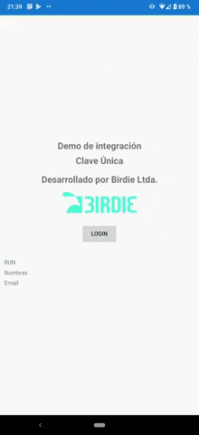

# ClaveUnicaDemo
Integración de Clave Única del Gobierno de Chile con Xamarin Forms y ASP.NET Core MVC

Esta solución de Visual Studio 2019 contiene cuatro proyectos:

- ClaveUnicaDemo, ClaveUnicaDemo.Android, ClaveUnicaDemo.iOS y ClaveUnicaDemo.UWP: aplicación de muestra de Xamarin Forms para probar la integración.
- ClaveUnicaDemo.API: Backend en ASP.NET Core MVC, que implementa el autenticador OpenIdConnect que requiere Clave Única.

Cómo hacer funcionar esto?

- Tener un servidor web compatible con ASP.NET Core accesible desde internet, para publicar el backend. Probado en un Azure App Service Linux.
- Registrarse en el sitio de la Clave Única, [llenando el formulario](https://claveunica.gob.cl/institucional/solicitud-activacion). Al enviar el formulario te entregarán inmediatamente las claves API que se requieren.
Para llenar los parámetros de URL de productivo y sandbox, tienen que usar una ruta tipo *https://servidor/signin-oidc*, básiscamente añadiendo /signin-oidc a la url pública del servidor.
- Para configurar las claves de API en el proyecto, dos opciones: editar el archivo appsettings.json y llenar las propiedades *ClaveUnicaClientId* y *ClaveUnicaClientSecret*, o si usas App Service, llenarlas en el portal de Azure.
- Cambiar la URL que está en el archivo [MainPage.xaml.cs](https://github.com/itoledo/ClaveUnicaDemo/blob/master/ClaveUnicaDemo/MainPage.xaml.cs) del proyecto ClaveUnicaDemo.
- Ejecutar cualquiera de las tres aplicaciones (Android, iOS y Windows 10) usando las credenciales de prueba (88.888.888-8, clave "testing").

O simplemente contactarnos escribíendonos a [ventas@birdie.cl](mailto:ventas@birdie.cl) y te lo podemos solucionar nosotros en [Birdie](https://www.birdie.cl).

